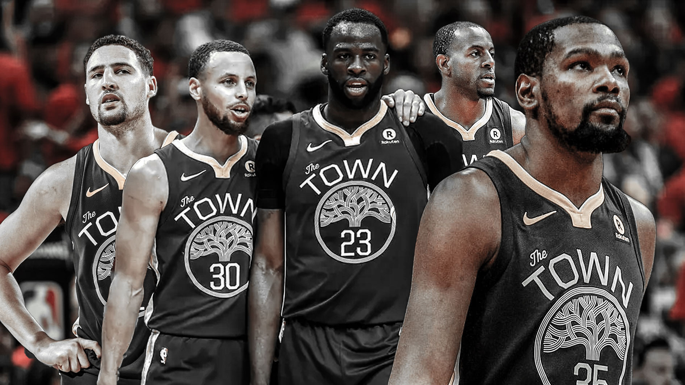
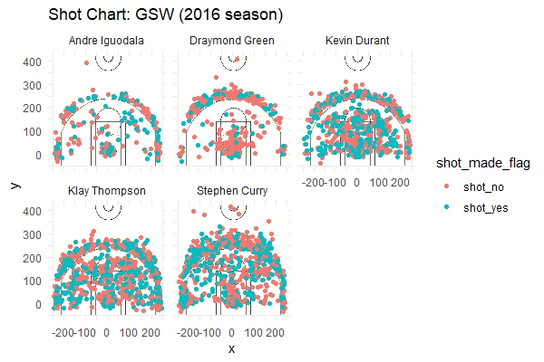
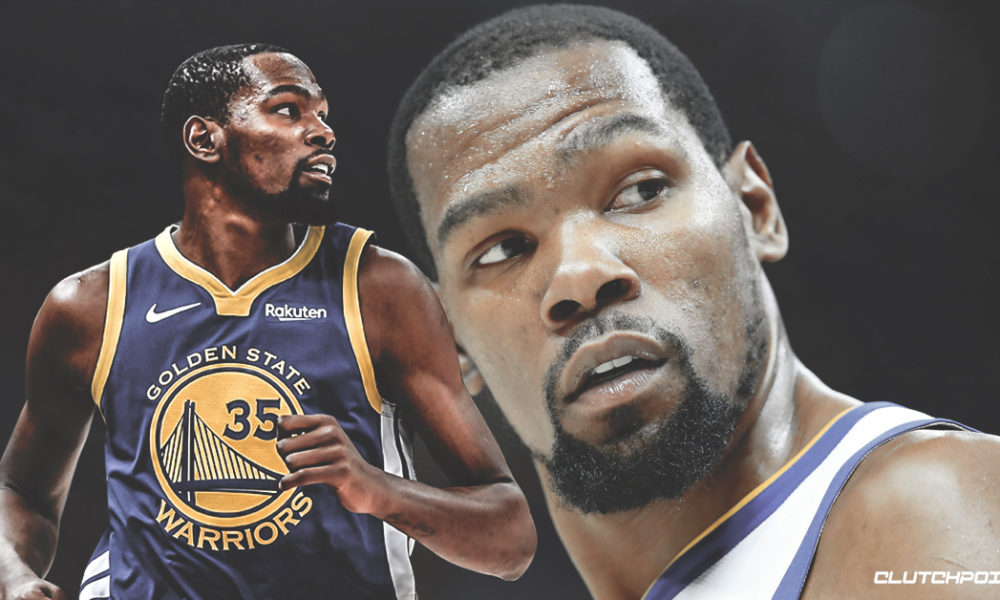
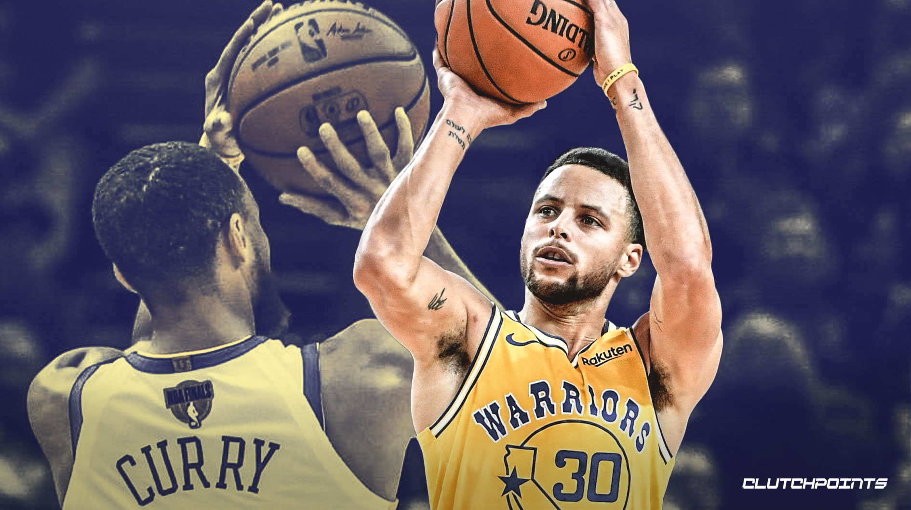
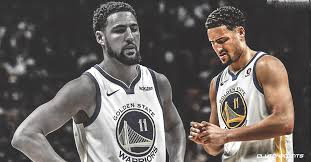
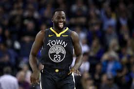
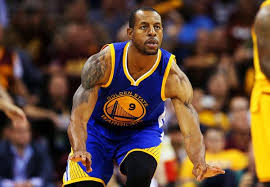

```{r out.width='80%', echo=FALSE, fig.align='center'}

```

```{r}
library(dplyr)
shotsdata <- read.csv(file="../data/shots-data.csv")
View(shotsdata)

Effective_shooting_percentage <- arrange(summarise(group_by(shotsdata, name),
                                           total=n(),
                                           made=sum(shot_made_flag=="shot_yes"),
                                           perc_made=(made/total)*100),desc(perc_made))

two_pt <- filter(shotsdata,shot_type=="2PT Field Goal")
twoPT_ESP <- arrange(summarise(group_by(two_pt, name),
                               twoPT_total=n(),
                               made=sum(shot_made_flag=="shot_yes"),
                               perc_made=(made/twoPT_total)*100),desc(perc_made))

three_pt <- filter(shotsdata,shot_type=="3PT Field Goal")
threePT_ESP <- arrange(summarise(group_by(three_pt, name),
                               threePT_total=n(),
                               made=sum(shot_made_flag=="shot_yes"),
                               perc_made=(made/threePT_total)*100),desc(perc_made))
```

#GOLDEN STATE WARRIORS BIG FIVE'S SHOOTING EFFICIENCY IN THE 2016 GOLDEN SEASON

##**Super team, super stars, super record, never before seen**


```{r out.width='80%', echo=FALSE, fig.align='center'}

```


####The Golden State Warriors' core players -- The Fantastic Four -- Kevin Durant, The Splash Brothers Klay Thompson and Stephen Curry, and Draymond Green, and the best sixth man Andre Iguodala have led the team to the 5th NBA Championship, with the best postseason record in NBA history by going 16-1.

####The 2016-2017 NBA Champion had swept all the opposing teams with their terrifying and record breaking field goal efficiency. With the join of Kevin Durant, the former prince of Oklahoma City Thunder, the firepower of Golden State Warriors has risen from the 6th and 2nd and some 1st of different kind of field goal ranking to the leading firepower of the league, with multiple field goal percentage ranking the first.

```{r}
Effective_shooting_percentage
```

```{r}
twoPT_ESP
```

```{r}
threePT_ESP
```
```{r out.width='80%', echo=FALSE, fig.align='center'}

```

####Each player in Golden State Warriors have finished the job efficiently, as we can see from the above statistics.

####In this article, we will focus on the players' effective shooting percentage, comparing them with each other, and as a team overall. Then, we will analyse each player's shooting habits as well as their comfortable area of shooting on the court.

```{r out.width='80%', echo=FALSE, fig.align='center'}

```

####Kevin Durant has made 915 shots, 495 of them were successfully made, with an effective shooting percentage of 54.098%, and had become the leading player in Golden State Warriors in effective shooting. Breaking down the statistics, Kevin Durant shoots the most effectively in mid range and two points range shooting, with the twoPT effective shooting of 60.65%, making him the second highest two points effective shooting player in the team. In terms of 3 pointers, Kevin did not do as well as the the splash brothers in the team, with only 38.6% of three points effective shooting, which makes him ranking the third in the team of 3 points effective shooting. Although it is comparable to the team that is well known for its 3 points firepower.

####From the shot chart above we can also see that most of KD's shots were made within the three-point-line, with 60.65% of accuracy, we can conclude that KD is almost unguardable within the three-point-line, becuase of his accuracy body length and basketball techniques.


```{r out.width='80%', echo=FALSE, fig.align='center'}

```

####Stephen Curry, in contrast of Durant, leads the team with the second highest three points effective shooting of 40.75%. This record is monstrous becuase almost half of the time Steph makes 3 pointers successfully. Although he only ranks the second in the team of three points effective shooting, his outstanding performance and firepower and miracle has made him the most terrifying player in the League. However, he ranks the third in the team in two points effective shooting, with 54.00% according to statistics, this maybe due to the increased defence from the opposing teams to Steph, preventing him from shooting in a comfortable spot. He ranks the forth in the fantastic four in the overall effective shooting percentage

####From the shooting chart, we see that Steph made most of his shots in mid to long range (outside of the three-point-line), his style seems to be more of shooting and less of contacting. He seems to be very accurate at the 45 degrees angle, as we can see that the blue dots (successful shots) are densed in that area.


```{r out.width='80%', echo=FALSE, fig.align='center'}

```

####Klay Thompson, one of the Splash Brothers, has an effective shooting percentage of 47.13%, which makes him third most effective shooting player in the team. He is the forth most effective 2PT shooting player (51.41%) and is ranking the first on the most effective 3PT shooting player (42.41%)in the team. His shoots more in 2-point range on the court, contrastin to Steph, who shoots more at the 3-point range.

####Klay's shooting habit can be seen from the shooting chart. He shot almost everywhere on the court, outside or inside on the three-point-line. He can do long, mid, and close range shooting.


```{r out.width='80%', echo=FALSE, fig.align='center'}

```

####Draymond Green due to his position, he focuses more on defense. Comparing to other players, he has the lowest shooting effectiveness, with 42.39%; 49.42% 2-point and 31.90% 3-point shooting effectiveness. But as a power forward, his statistics is still terrifying.

#### From the shot chart, we can see that Green shoots mostly under the basket. With this amount of 2PT effective shooting and a good defensive player, he won the NBA Defensive Player of the year.


```{r out.width='80%', echo=FALSE, fig.align='center'}

```

####Andre-iguodala is the sixth man of the team Golden State Warriors. His position is a shooting guard. Surprisingly he is the second most effective shooting player in the team, with 51.75%. He also ranks the first in 2-point and the forth in 3-point effective shooting, with 63.81% and 36.02% respectively. This statistics has shown his quality as a sixth man. He does not go on court often, but once he does, he scores effectively.

####According the the shot chart, the shots he made (total number of dots) are far less dense than the other players, due to the reason that he stays more in bench than the other four players. However, we can still see that once he is on court, he can shoot from close to long range, with a fair accuracy.

##To summarise, the Golden State Warriors dynasty will continue as long as all the players keep improving and stay healthy. GSW will be more terrifying next year once KD has a more deepened bonding with the team, and once they finish preparing and training for the next season. They can work more on their defensive play as well, in that case, they will be a well-rounded team which excels in both offensive and defensive play.


